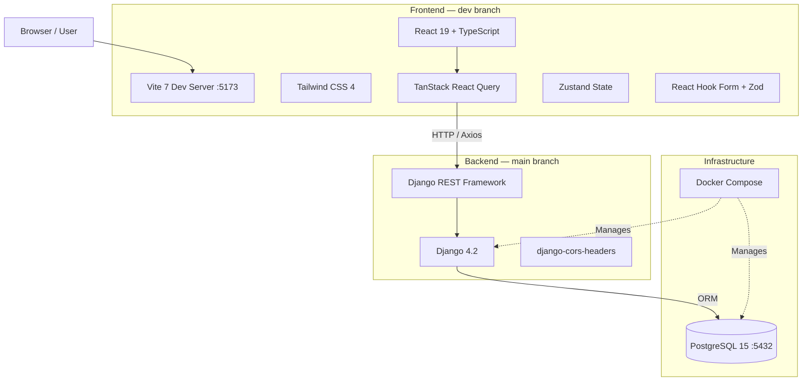
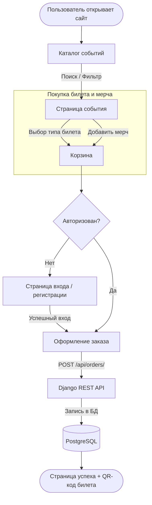

```markdown
<div align="center">


# 🏅 SpoitHub — Delux

**Платформа для спортивных мероприятий и маркетплейс экипировки**


[О проекте](#-о-проекте) • [Архитектура](#%EF%B8%8F-архитектура) • [User Flow](#-user-flow) • [Запуск](#-запуск) • [Ветки](#-ветки)

</div>

---

## 🚀 О проекте

**SpoitHub Delux** — это полноценная SaaS-платформа с REST API бэкендом и SPA фронтендом.

Проект решает проблему разрозненности сервисов: регистрация на спортивный старт на одном сайте, покупка экипировки — на другом. **SpoitHub** объединяет всё в едином флоу:

> *"Нашёл событие → Купил билет → Добавил мерч в корзину → Получил QR-код → Пришёл на старт"*

### Ключевые возможности
- 🗓 **Events:** Каталог событий с поиском, фильтрацией, разные типы билетов и лимиты слотов.
- 🛒 **Marketplace:** Магазин экипировки и мерча, привязанный к конкретным событиям или общий каталог.
- 👤 **Кабинет участника:** Мои билеты с QR-кодами, история заказов.
- 🔐 **Ролевая модель:** Организатор / Участник / Администратор.

---

## 🏗️ Архитектура

Проект построен по архитектуре **Decoupled SPA**: Django REST Framework отдаёт JSON API, React SPA потребляет его.



### Технический стек

| Часть | Технологии |
| :--- | :--- |
| **Backend** | Django 4.2, Django REST Framework, django-cors-headers |
| **Frontend** | React 19, TypeScript 5.9, Vite 7, Tailwind CSS 4 |
| **State** | Zustand 5 |
| **Data Fetching** | TanStack React Query 5 + Axios |
| **Forms** | React Hook Form 7 + Zod 4 |
| **UI** | lucide-react, clsx, tailwind-merge, dayjs |
| **Database** | PostgreSQL 15 (psycopg2-binary) |
| **DevOps** | Docker, Docker Compose |

---

## 🔄 User Flow



---

## 🌿 Ветки

| Ветка | Статус | Содержание |
| :--- | :---: | :--- |
| `main` | ✅ Stable | Backend (Django + DRF + Docker) |
| `dev` | 🚧 Active | Backend + Frontend (React + TS + Vite) |

> Все новые фичи разрабатываются в `dev` и после ревью мержатся в `main`.

---

## 🛠 Запуск

### Предварительные требования
- [Docker](https://www.docker.com/) и Docker Compose
- [Node.js 20+](https://nodejs.org/) (для запуска фронтенда)
- [Python 3.11+](https://www.python.org/) (для локального запуска без Docker)

---

### 🐳 Быстрый запуск через Docker (Backend)

**1. Клонировать репозиторий:**
```bash
git clone https://github.com/SpoitHub/delux.git
cd delux
```

**2. Создать файл `.env` из примера:**
```bash
cp .env.example .env
```

**3. Заполнить `.env`:**
```ini
# PostgreSQL
POSTGRES_DB=spoithub_db
POSTGRES_USER=postgres
POSTGRES_PASSWORD=your_password

# Django
DJANGO_SECRET_KEY=your-secret-key-here
DEBUG=1

# Database connection
DB_NAME=spoithub_db
DB_USER=postgres
DB_PASSWORD=your_password
DB_HOST=db
DB_PORT=5432
```

**4. Запустить контейнеры:**
```bash
docker compose up --build
```

Бэкенд: `http://localhost:8888` | Админка: `http://localhost:8888/admin`

---

### 💻 Локальный запуск без Docker (Backend)

```bash
# 1. Перейти в папку бэкенда
cd backend

# 2. Создать и активировать виртуальное окружение
python -m venv venv
venv\Scripts\activate      # Windows
source venv/bin/activate   # Mac/Linux

# 3. Установить зависимости
pip install -r requirements.txt

# 4. Применить миграции
python manage.py migrate

# 5. Создать суперпользователя
python manage.py createsuperuser

# 6. Запустить сервер
python manage.py runserver 0.0.0.0:8888
```

---

### ⚛️ Запуск фронтенда (ветка `dev`)

```bash
# 1. Переключиться на ветку dev
git checkout dev

# 2. Перейти в папку фронтенда
cd frontend

# 3. Установить зависимости
npm install

# 4. Запустить dev-сервер
npm run dev
```

Фронтенд: `http://localhost:5173`

> ⚠️ Перед запуском фронтенда убедись, что бэкенд запущен на `http://localhost:8888`.

---

## 📂 Структура проекта

```text
delux/
├── .env.example              # Пример переменных окружения
├── .gitignore
├── docker-compose.yml        # PostgreSQL 15 + Django (port 8888)
├── LICENSE
│
├── backend/                  # Django REST API (main + dev)
│   ├── Dockerfile
│   ├── manage.py
│   ├── requirements.txt      # Django 4.2, DRF, psycopg2, cors-headers
│   └── config/
│       ├── settings.py
│       ├── urls.py
│       ├── wsgi.py
│       └── asgi.py
│
└── frontend/                 # React SPA (только ветка dev)
    ├── index.html
    ├── package.json          # React 19, TS 5.9, Vite 7, Tailwind 4
    ├── vite.config.ts
    ├── tsconfig.json
    └── src/
```

---

## 🗺 Roadmap

| Этап | Статус | Задачи |
| :--- | :---: | :--- |
| **Setup** | ✅ | Docker, Django, React + Vite, Tailwind |
| **Auth** | 🔴 | JWT авторизация, роли (Participant / Organizer) |
| **Events** | 🔴 | CRUD событий, каталог, поиск/фильтры |
| **Tickets** | 🔴 | Типы билетов, бронирование, QR-коды |
| **Marketplace** | ⚪ | Каталог товаров, корзина, заказы |
| **Dashboard** | ⚪ | Личный кабинет, история, аналитика |

---

## 🤝 Как внести свой вклад (Contributing)

Мы приветствуем вклад в развитие проекта! Чтобы предложить изменения:
1. Сделайте форк репозитория (Fork)
2. Создайте ветку для вашей фичи (`git checkout -b feature/AmazingFeature`)
3. Закоммитьте изменения (`git commit -m 'feat: Add some AmazingFeature'`)
4. Запушьте в ветку (`git push origin feature/AmazingFeature`)
5. Откройте Pull Request в ветку `dev`

---

## 📄 Лицензия

Проект распространяется под лицензией [MIT](LICENSE). Подробности смотрите в файле `LICENSE`.

<div align="center">
  <sub>Built with ❤️ by SpoitHub Team · Almaty, Kazakhstan</sub>
</div>
```